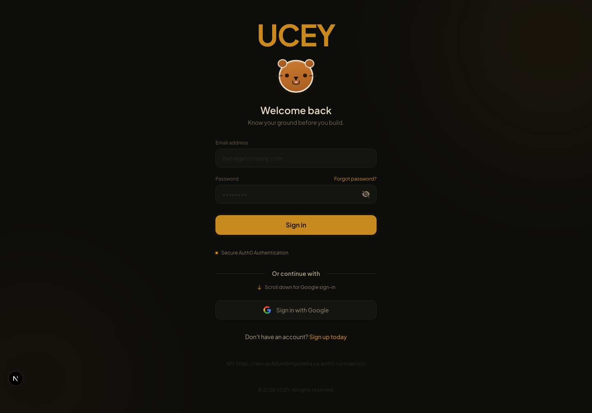
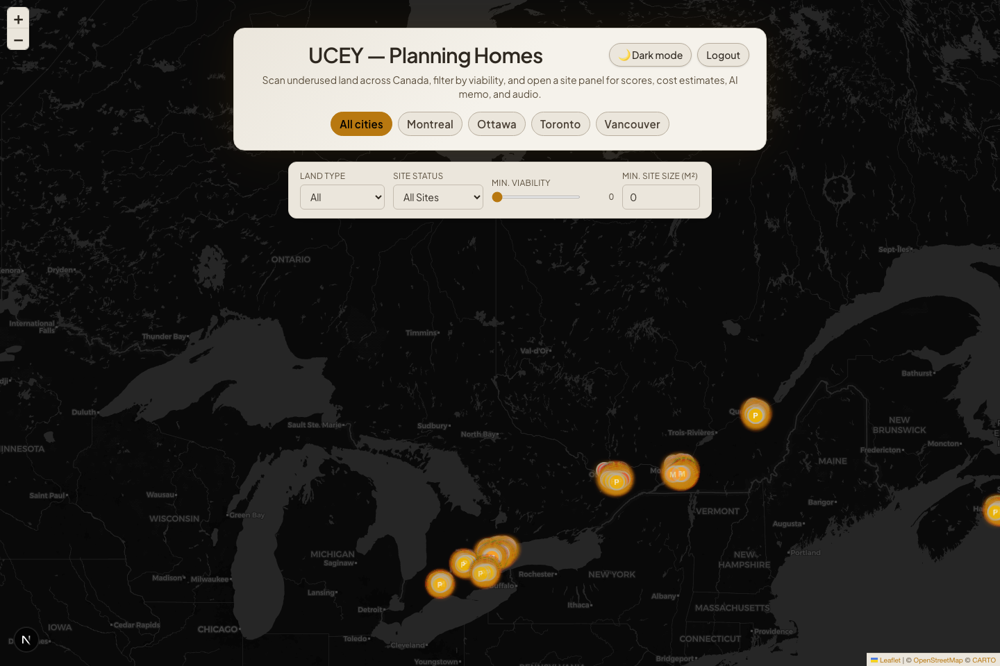
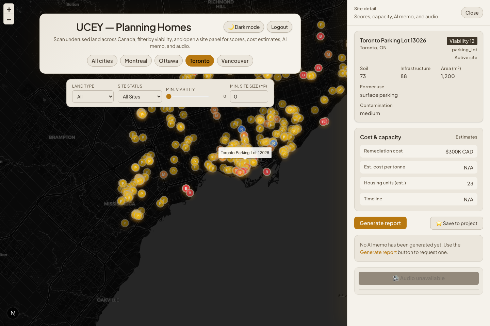

# UCEY

**Know your ground before you build.**

UCEY is a Canada-focused planning interface for finding underused urban land and turning it into housing opportunities. The app combines brownfields, parking lots, dead malls, rail corridors, and other candidate parcels into one map, then helps a planner inspect each site with scores, cost estimates, AI-generated memos, and optional text-to-speech.

This repository currently includes:
- authenticated entry flow
- interactive Canada map with site markers
- active / inactive filtering
- brownfield and non-brownfield candidate datasets
- right-side detail panel for site review
- Gemini report generation
- ElevenLabs audio playback

## Tech tree

```text
UCEY
├── Frontend
│   ├── Next.js 16
│   ├── React 19
│   ├── TypeScript
│   ├── Tailwind CSS
│   └── Leaflet
├── Backend
│   ├── Next.js API routes
│   ├── Node.js
│   ├── Zod
│   └── csv-parse
├── Data + storage
│   ├── Supabase
│   ├── Postgres / PostGIS
│   ├── FCSI datasets
│   └── OpenStreetMap / non-brownfield CSV assets
├── AI + media
│   ├── Gemini
│   └── ElevenLabs
└── Auth + testing
    ├── Auth0
    └── Playwright
```

## Product snapshots

### Login



### Canada map overview



### Selected site with detail panel



## UI overview

The interface is organized around a single planner workflow:

1. Sign in from the Auth0-backed login screen.
2. Open the Canada map and choose a city preset or view all cities.
3. Filter the visible site inventory by land type, site status, viability, and minimum site size.
4. Click a marker to open the right-side panel.
5. Review scores, cost and capacity estimates, contamination context, and former land use.
6. Generate an AI planner memo and optionally synthesize it into audio.

Main UI elements:

| Area | What it does |
|---|---|
| Top header | Shows the product title, theme toggle, logout button, and city shortcuts. |
| Filter bar | Narrows the map by land type, `All Sites / Inactive Sites / Active Sites`, minimum viability, and minimum site size. |
| Map canvas | Displays candidate sites as colored markers across Canada. |
| Marker colors | `Red` brownfields, `yellow` parking lots, `blue` rail corridors, `orange` dead malls, `green` fallback/other. |
| Right-side panel | Opens when a site is selected and shows detailed planning context. |

## Site panel guide

When a site is selected, the side panel becomes the main inspection area. It is meant to answer a planner's first questions quickly: what is this site, how risky is it, how much housing could it support, and should we prioritize it?

### Site summary card

The first card shows the site name, location, site type, status tag, and headline scores.

| Field | Meaning |
|---|---|
| Viability | Overall planning heuristic for how attractive the site is as a housing candidate. Higher means more promising. |
| Soil | Ground suitability estimate. Higher means fewer expected constraints for development foundations or site prep. |
| Infrastructure | Service/readiness estimate. Higher means better surrounding access to transit, utilities, and urban support conditions. |
| Area (m²) | Estimated site area used for rough capacity and cost calculations. |
| Former use | What the parcel or site is currently or previously used for, such as parking, industrial land, rail, or retail. |
| Contamination | Known or inferred contamination risk from source data. |
| Site status | Normalized as `Active site` or `Inactive site` where source data supports that distinction. |

### Cost & capacity card

This section turns raw site data into quick planning estimates.

| Field | Meaning |
|---|---|
| Remediation cost | Rough cleanup or site preparation estimate in CAD. |
| Est. cost per tonne | Mainly used for brownfield-style contamination data when cost-per-tonne information exists. |
| Housing units (est.) | Approximate housing capacity based on site area assumptions. |
| Timeline | Estimated remediation or readiness timeline when enough source data exists. |

### Planner memo

The `Generate report` button creates a short AI briefing note for the selected site. The memo is designed for planner review, not final engineering or legal approval. It summarizes:
- current site condition
- soil and contamination risk in plain language
- infrastructure context
- housing potential
- recommendation priority

### Audio briefing

The panel can turn the memo into spoken audio. This makes the selected site behave more like a voice-assisted planning brief.

### Save to project

The UI includes a save action in the panel for project-based workflows. This is the start of a shortlist workflow for planners, architects, and developers.

## What the scores mean

The score system is intentionally heuristic. It helps rank and compare sites quickly, but it is not a replacement for engineering due diligence.

| Score | High score means | Current source |
|---|---|---|
| Viability | Stronger overall redevelopment candidate | Derived from source dataset or backend estimates |
| Soil | Better physical suitability for development | Non-brownfield `soil_suitability` or brownfield proxy logic |
| Infrastructure | Better surrounding readiness and urban support | Non-brownfield `infrastructure_readiness` or brownfield proxy logic |

Important nuance:
- non-brownfield entries use dataset-supplied soil and infrastructure fields
- FCSI brownfields use derived proxy scores rather than real geotechnical reports
- viability is a screening signal, not a permit-ready conclusion

## Data layers in the app

The app currently merges multiple site sources into one map experience:

| Layer | Status | Notes |
|---|---|---|
| Supabase-backed sites | Implemented | Main stored site records and reports |
| FCSI brownfields | Implemented | CSV-built contaminated site layer with derived costs and proxy scores |
| Non-brownfield candidates | Implemented | Parking lots, dead malls, rail corridors, and similar underused land |
| Demo fallback sites | Implemented | Keeps the UI functional even without full backend data |

Raw data artifacts live under `data/raw/`, including:
- `data/raw/fcsi/`
- `data/raw/non_brownfield/`
- `data/raw/all_candidate_sites_normalized.csv`

## Current implemented features

- Canada-bounded map navigation
- city presets for Montreal, Ottawa, Toronto, and Vancouver
- merged site inventory from multiple sources
- active / inactive / all-site filtering
- land-type filtering
- site detail panel with status tag
- AI memo generation
- audio synthesis endpoint and in-panel playback
- login, signup, reset-password, and logout flow
- dark mode toggle

## Future applications and plans

Potential future applications:

1. **Municipal land triage**
Cities could rank underused parcels by readiness, contamination risk, and housing potential before starting formal planning studies.

2. **Developer acquisition screening**
Developers could use the platform to shortlist underused parcels and compare redevelopment scenarios faster than manual GIS review.

3. **Public sector funding prioritization**
Provincial or federal agencies could identify which brownfield or infill sites deserve grants, remediation support, or planning acceleration.

4. **Scenario planning**
The platform could compare low-rise, mid-rise, and mixed-use outcomes across the same parcel and estimate tradeoffs in cost, timeline, and unit yield.

5. **Portfolio monitoring**
A city or developer could track hundreds of candidate sites over time and get alerts when a parcel moves from active to inactive, or when priority conditions improve.

Near-term roadmap:

- show more site datasets directly in the production map flow
- expand coverage to more Canadian cities beyond the current core dataset
- improve field-level explanations for users unfamiliar with planning metrics
- strengthen report persistence and project-saving workflows
- add exportable PDF planner briefs
- expand AR / 3D presentation layers
- improve scoring transparency with clearer formulas and source attribution
- extend the model beyond Canada later so the platform can support other countries and eventually become usable worldwide

## Quick start

```bash
cp .env.example .env.local
npm install
npm run dev
```

Open `http://localhost:3000`.

## Environment variables

| Variable | Purpose |
|---|---|
| `NEXT_PUBLIC_SUPABASE_URL` | Supabase project URL |
| `NEXT_PUBLIC_SUPABASE_ANON_KEY` | Public Supabase key |
| `SUPABASE_SERVICE_ROLE_KEY` | Server-side Supabase access |
| `AUTH0_DOMAIN` | Auth0 tenant domain |
| `AUTH0_CLIENT_ID` | Auth0 application client id |
| `AUTH0_CLIENT_SECRET` | Auth0 application client secret |
| `AUTH0_SECRET` | Session encryption secret for Auth0 SDK |
| `AUTH0_AUDIENCE` | Optional API audience |
| `GEMINI_API_KEY` | Gemini site-report generation |
| `ELEVENLABS_API_KEY` | ElevenLabs text-to-speech |
| `ELEVENLABS_VOICE_ID` | Voice selection for audio memo playback |

## Useful scripts

```bash
npm run dev
npm run build
npm run db:seed:demo
npm run data:build
npm run data:integrate:non-brownfield
npm run ingest:brownfields
npm run db:verify
```

## API overview

| Endpoint | Purpose |
|---|---|
| `GET /api/sites` | Main DB-backed site list |
| `GET /api/sites/fcsi` | Brownfield/FCSI-derived site list |
| `GET /api/sites/non-brownfield` | Parking lot, dead mall, rail corridor, and related candidate list |
| `GET /api/sites/:id` | Site detail for DB-backed sites |
| `GET /api/sites/:id/report` | Stored planner memo |
| `POST /api/sites/:id/report/generate` | Generate and persist a report for DB-backed sites |
| `POST /api/sites/fcsi/report` | Generate transient report for non-DB sites |
| `POST /api/audio/synthesize` | Create TTS audio from memo text |
| `GET /api/auth/logout` | Clear session cookies and return to login |

## Known limits

- Some scores are heuristic rather than engineering-grade measurements.
- FCSI brownfield scores are derived proxies, not formal geotechnical analysis.
- Source datasets can still contain parcels that need manual review for true redevelopment suitability.

## Team

Built for HackCanada 2026 by Daniel, Adhyan, Yeshi, and Bora.
